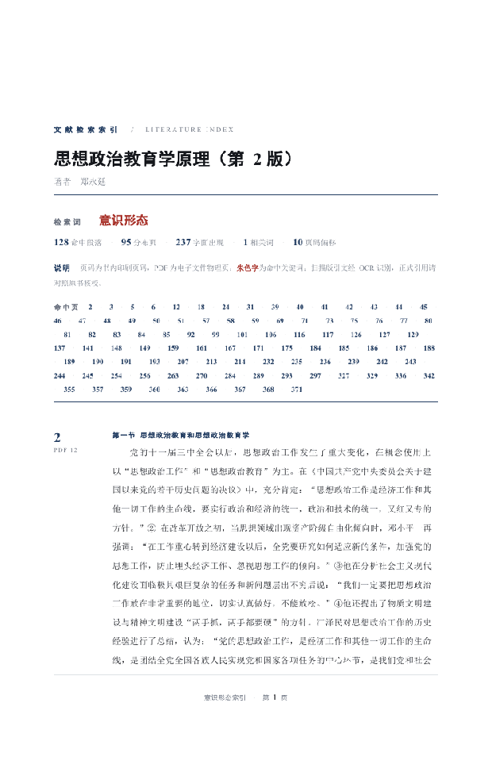

# book-topic-index

> 把一本**扫描版学术书**，变成一份**页码准确、可对账、可直接引用**的主题索引。

[](https://github.com/anthropics/skills)
[](https://docs.anthropic.com/en/docs/claude-code)
[](#兼容性)
[](https://github.com/RapidAI/RapidOCR)
[](LICENSE)
[](https://skills.sh/b/BaymaxStudio/book-topic-index)

你有一本书的 PDF（多半是超星/读秀那种**没有文字层的扫描件**）和一个概念，想找"这本书里讲它的地方都在哪几页、原文是什么"。人工翻几百页要几小时，随手 OCR 出来的文本又给不了**能写进脚注的页码**。

这个 Skill 干三件事，而且每一件都留证据：**定位**（书内印刷页码 + PDF 物理页）、**对账**（零漏检审计）、**交付**（可引用的 Word 索引 + 原书高亮）。

---



> 上面三帧是真跑出来的：索引首页（左侧页码导轨）→ 索引条目页 → 原书高亮页。

## 你什么时候需要它？

1. **写文献综述**：想知道"意识形态"在《思想政治教育学原理》全书出现了哪些页、原文是什么，并且要直接写进脚注。
2. **做书后索引 / 编辑校对**：为一份扫描版书稿生成术语索引，页码要跟纸书对得上。
3. **跨书概念梳理**：同一概念在郑永廷、张耀灿几本书里分别怎么讲、集中在哪些章节。

## 它会交付什么？

每一本书产出四件东西：

| 产物 | 内容 |
|---|---|
| **索引.docx** | 勘校索引版式：左栏书内页码 + 右栏原文，关键词朱色标出，首页页码可点击跳转 |
| **标注版.pdf** | 原书 PDF + 黄色高亮，精确到行，供逐条核对原文 |
| **命中明细.csv** | 页码 / 章节 / 定位句 / 完整段落，可筛选排序 |
| **统计.json** | 页码校准偏移与投票分布、命中统计、零漏检审计结论 |

**真实运行数据**（不是示例，是实测）：

| 书 | 页数 | 命中段落 | 分布页 | 出现次数 | 页码偏移 | 零漏检审计 |
|---|---|---|---|---|---|---|
| 思想政治教育学原理（第2版）· 郑永廷 | 387 | 127 | 94 | 237 | 10（359/359 页一致） | ✅ 237=237 |
| 思想政治教育学前沿 · 张耀灿 | 531 | 46 | 37 | 106 | 15（471/484 页一致） | ✅ 106=106 |
| 现代思想政治教育学 · 张耀灿 | 485 | 77 | 61 | 117 | 15（374/377 页一致） | ✅ 117=117 |

## 为什么需要它，而不是直接问 Agent？

因为有三件事 Agent 临时做不到：

1. **印刷页码 ≠ PDF 页码**。纸书前面有封面、目录、序言，PDF 第 12 页可能是书里的第 2 页。这个 Skill 读每页页眉/页脚的页码，用**众数投票**自动算出整本书的偏移量，并把投票证据留在 统计.json 里。
2. **扫描件没有文字层**，`pdftotext` 只能提出水印。这个 Skill 自动判别并走 OCR：macOS 用本机 Vision，Windows / Linux 用 RapidOCR（同为离线、无需联网）。
3. **"查全了"需要能对账**。它会把原文里关键词的真实出现次数和检索结果逐页对账，任何漏页都会暴露出来——这是能写进论文的前提。

## 快速开始

```bash
npx skills add BaymaxStudio/book-topic-index
```

装完可以直接说：

> 这本书的扫描件在 ~/Downloads/book.pdf，帮我把里面所有讲「意识形态」的地方找出来，标出书里的页码和原文，给我一份 Word 索引和一份标黄的 PDF。

首次运行会自动准备依赖并在缓存目录建 venv（`python scripts/setup_env.py` 会装 `python-docx` / `pymupdf` / `rapidocr` / `onnxruntime`），产物与二进制都落在缓存目录，不污染 Skill 目录。

## 触发方式

这些话都会触发它：

- 「把这本书里有关 **X** 的部分标出来，给出页码和内容」
- 「这本书里 **X** 出现在哪几页」
- 「帮我做一份 **X** 的主题索引 / 文献索引」
- 「找出讲 **X** 的段落」
- 「把 PDF 里讲 **X** 的地方标黄」
- 「PDF 的页码和书里的页码对不上，帮我换算」
- 只给一个 PDF 加一个关键词，不说要做什么——也应该触发

## 示例

**输入**：一本 531 页的扫描版 PDF + 关键词「意识形态」

**过程**：自动判别为扫描件 → OCR 300dpi（macOS Vision / 其他平台 RapidOCR）→ 按行距与缩进还原段落 →
读取页眉页码算出偏移 15 → 检索并做零漏检审计

**输出**：

```
### 第 42 页 ⟨PDF 57⟩
> 第一章 现代思想政治教育学概论 第一节 ...
……始终不渝地对人们施加**意识形态**的影响和教育……
```

外加 37 页范围内的全部命中、一份 Word 索引、一份 458 处高亮的 PDF。

## 它和同类有什么不同？

| | 本 Skill | [pdf-deep-reader](https://github.com/manrods/pdf-deep-reader-skill) | [brain-md](https://github.com/anthonyfuar/brain-md) | [MinerU-Skill](https://github.com/Nebutra/MinerU-Skill) |
|---|---|---|---|---|
| 主要目的 | **在书里定位并交付可引用索引** | 省 token 地读 PDF 问答 | 把书变成可问答的 skill | PDF → Markdown |
| 书内印刷页码校准 | ✅ 众数投票 + 留证据 | ❌ | ❌ | ❌ |
| 零漏检审计（可对账） | ✅ | ❌（只标 confidence） | ❌ | ❌ |
| 原书高亮回写 | ✅ | ❌ | ❌ | ❌ |
| 中文扫描版学术书 | ✅ 实测三本 | 未声明 | PDF/EPUB/DOCX | ✅ 解析 |
| 交付物 | Word 索引 + 标注 PDF + CSV | 本地缓存 | Skill 目录 | Markdown |

一句话：同类卖的是"**读得省**"，它卖的是"**引用得准**"。

## 三层检索：可信度是分开的

概念检索有三层，**它们不会混在一张表里**——因为"我查全了"这句话只能由可对账的层来说。

| 层 | 机制 | 可信度 | 出现在哪 |
|---|---|---|---|
| **Tier 1 字面** | 正则精确匹配 | **可审计**，零漏检对账 | 主索引、明细表 |
| **Tier 2 相关词** | 同义/派生表述（配置 related） | **可审计**，同一条流水线 | 明细表，标记为"相关词" |
| **Tier 3 语义** | 启发式候选：信号词 + 命中的邻段 | **判断性，不保证查全** | 单独的「待确认」清单 |

Tier 3 只负责把"可能讲了但没用这个词"的段落从整本书缩小到可控规模（实测：三本书分别产出 227 / 148 / 195 条候选），**判定权交回给人**，结论不写进主索引。

**为什么不自动做语义判定**：我们实测了 macOS 本机的 NLEmbedding 中文句向量——可用（640 维），但区分度不够：

| 指标 | 原始余弦 | 去均值余弦 |
|---|---|---|
| 同主题均值 | 0.9818 | 0.2957 |
| 无关均值 | 0.9708 | −0.0005 |
| **AUC** | **0.806** | **0.806** |

AUC 0.806 意味着约 19% 排序错误。对"召回不能漏"的研究场景，这个水平过不了验证门，所以我们**不把它作为默认路径**。宁可让 Agent 读候选清单逐条判断，也不给你一个看起来聪明、实际会漏的自动结论。

## 安全边界

- **只读原文件**：不会修改你的输入 PDF；标注版是另存的新文件。
- **不联网**：OCR 用本机 Vision（macOS）或 RapidOCR（内置离线模型），全程离线，不上传任何内容。
- **写入范围**：只写你指定的输出目录，以及缓存目录 `~/.cache/book-topic-index/`（依赖与二进制）。Skill 目录保持只读可用。
- **会停下来问你的情况**：判断不出扫描件还是文字版时、页码校准投票分散时、要扩大检索词范围时。
- **OCR 的诚实声明**：扫描版正文约 99% 准确，个别错字存在。**正式引用前请对照标注版 PDF 核对**；提供 Word 版可消除 OCR 错字。

## 文件结构

```
book-topic-index/
├── SKILL.md              工作流与陷阱（Agent 读这个）
├── README.md             本文件
├── scripts/
│   ├── pdf_lines.py      PDF → 逐行文本+坐标（自动判别扫描/文字版）
│   ├── ocr_rapid.py      跨平台 OCR 后端（RapidOCR，Win/macOS/Linux）
│   ├── scan.py           切段 + 页码众数校准 + 检索
│   ├── audit.py          零漏检审计（对账工具）
│   ├── make_docx.py      生成勘校索引版式 Word
│   ├── word_scan.py      Word 文本通道 + 页码对齐
│   ├── ocrpdf.swift      macOS Vision OCR（可选高质量后端）
│   ├── markpdf.swift     macOS PDF 高亮（可选）
│   ├── markpdf.py        跨平台 PDF 高亮（PyMuPDF）
│   ├── build_swift.sh    编译 macOS 工具（产物落缓存目录）
│   ├── setup_env.py      跨平台准备 python 依赖
│   ├── setup_env.sh      macOS 便捷入口
│   ├── run_pipeline.py   跨平台一条命令跑完
│   ├── run_pipeline.sh   macOS 便捷入口
│   ├── selftest.py       程序化验收（跑链路 + 断言）
│   ├── check_schema.py   校验 lines.jsonl / annotations.json
│   └── make_fixture.py   生成合成扫描样本（CI / smoke）
├── references/
│   ├── pipeline.md       段落切分阈值、页码校准算法、排障清单
│   └── docx-design.md    Word 版式设计系统与 OOXML 踩坑
├── requirements.txt      基础依赖（python-docx + pymupdf）
├── requirements-ocr.txt  追加跨平台 OCR（rapidocr + onnxruntime）
├── .github/workflows/    CI：三平台 smoke
└── evals/
    └── evals.json        测试用例与客观断言
```

## 验证与测试

```bash
# 跨平台一条命令（Windows / macOS / Linux）
python scripts/run_pipeline.py <book.pdf> <book.json> <outdir>
# macOS 也可继续用 bash 入口
bash scripts/run_pipeline.sh <book.pdf> <book.json> <outdir>
# 程序化验收：跑链路并断言页码偏移 / 命中数 / 产物
python scripts/selftest.py --pdf <book.pdf> --config <book.json> --out <outdir> --ocr rapid
```

**不许退化的基线**（三本真书，任何改动后必须仍然成立）：

```
郑永廷  237 = 237  ✓零漏检
前沿    106 = 106  ✓零漏检
现代    117 = 117  ✓零漏检
```

## 兼容性

**三平台能力一致**：扫描件 OCR、页码校准、零漏检审计、索引 Word、标注版 PDF 在 Windows / macOS / Linux 都能跑。

| 环节 | macOS | Windows / Linux |
|---|---|---|
| 扫描件 OCR | 本机 Vision（默认，快且准） | RapidOCR（内置模型，离线） |
| PDF 高亮 | PDFKit（默认） | PyMuPDF |
| 文字层抽取 | pdftotext，缺失时 PyMuPDF | 同上 |
| 页码校准 / 审计 / Word 索引 | 纯 Python | 纯 Python |

`--ocr auto` 自动选后端：macOS 且 Swift 可用时用 Vision，否则用 RapidOCR。

### 安装

```bash
# 一行装齐（三平台通用）
python scripts/setup_env.py

# 或手动
pip install -r requirements-ocr.txt     # 跨平台 OCR（Windows/Linux 必需）
pip install -r requirements.txt         # 只要 Word/PDF 基础时
```

Windows 额外可选：`winget install JohnMacFarlane.Pandoc`（用于 Word 输入）。`pdftotext`（poppler）非必需——没有时自动回退 PyMuPDF。

**RapidOCR 的诚实声明**：模型内置离线，中文印刷体质量接近本机 Vision。实测同一扫描节选，页码偏移、命中页集合、命中段落数与本机 Vision **完全一致**；因检测端缩放，个别小字行可能漏检（默认 `--limit-side-len 2000`，可调大）。正式引用前请对照标注版 PDF。

## 致谢

- 技能打磨方法论参考 [anthropics/skills · skill-creator](https://github.com/anthropics/skills)。
